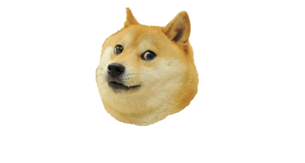

# doge-selection

   
  
   
  <i>Doge's quest to find doggo treats.</i>

A 2D Javascript based project designed to simulate natural selection through the use of genetic
algorithms. The animated ‘doge’ subjects are optimised through a fitness function and iterated
continuously through cycles of generations to achieve its goal (dog treats).

See it here: https://dencangan.github.io/doge-selection/index.html

## Doge Summary
Each individual Doge contains a series of randomised vectors (these can also be called genes). At the end of each generation, the Doges' that are closest to the 
treat is selected into the mating pool to create new Doges' for the next generation. This cycle is repeated until the average doge population 
fitness increase over time. The observation result can be made where after many iterations, the Doges' become very efficient at 
reaching the treat, effectively becoming good doggos.

## Fitness Function Definition
Uses simple Euclidean distance (Pythagoras theorem). 

`
Square root of 'treat position X' squared + 'treat position Y' squared.
`

https://en.wikipedia.org/wiki/Euclidean_distance

### Credit and inspirations:
 
https://dev.to/lukegarrigan/genetic-algorithms-in-javascript-mc3
 
https://www.youtube.com/watch?v=_Vxjh1QxApA
 
https://dogecoin.com/